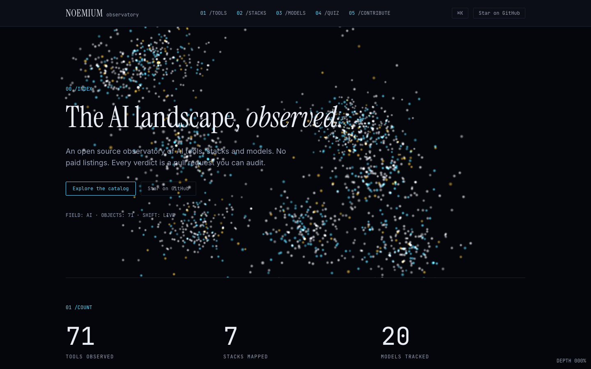

# Noemium

[](https://github.com/SaneSanders/noemium/actions/workflows/ci.yml)



**The AI landscape, observed.**

AI directories are pay-to-list. [Noemium](https://noemium.com) is open
source. Every recommendation is a PR you can audit. No theory, receipts.

Noemium is a hub for AI practitioners:

- **Tools** — honest verdicts (`ship` / `situational` / `skip`) with named
  limitations and evidence links.
- **Agents** — operational field guides with install paths, requirements, cost
  scenarios, security boundaries, and explicit evidence tiers. Grok Bot and
  Grok Build are treated as separate products.
- **Stacks** — copy-pasteable recipes: which tools combined, at what monthly
  cost, for which use case.
- **Models** — context windows, per-MTok pricing, strengths and anti-use
  cases, with attributed sources.

Every entry carries `last_verified`, an `observed_by` GitHub handle, and at
least one receipt. Affiliate links, when they exist, are always declared.

## Stack

- [Astro](https://astro.build) (static output) + Preact islands
- Tailwind CSS v4 (CSS-first config, "Bold Grid" design tokens)
- Content: Astro Content Collections (YAML + Markdown), zod-validated
- No WebGL/motion libraries — typographic hero, CSS-only motion

## Quick start

```sh
npm install
npm run dev        # http://localhost:4321
```

Other commands:

```sh
npm run build      # static build to dist/
npm run check      # astro check (types)
npm run validate   # validate all content entries (CI-friendly)
```

## Content structure

```
src/content/
├── tools/    # *.yaml — one file per tool (see cursor.yaml as template)
├── agents/   # *.yaml — strict field guides and verdict-free Radar entries
├── stacks/   # *.md   — frontmatter + recipe body (see solo-founder-saas.md)
└── models/   # *.yaml — one file per model (see gpt-5-6-sol.yaml)
```

Schemas live in `src/content-schemas.ts` and are enforced both at build
time and by `npm run validate`. Agent entries declare `field-tested`,
`source-verified`, or `radar`; Radar entries cannot carry verdicts or hard cost
scenarios.

## Contributing

Every entry is a pull request. See [CONTRIBUTING.md](CONTRIBUTING.md) — it
takes about 5 minutes to submit a tool.

Design decisions are governed by [DESIGN.md](DESIGN.md). Content is licensed
[CC BY 4.0](LICENSE-CONTENT); code is [MIT](LICENSE).
